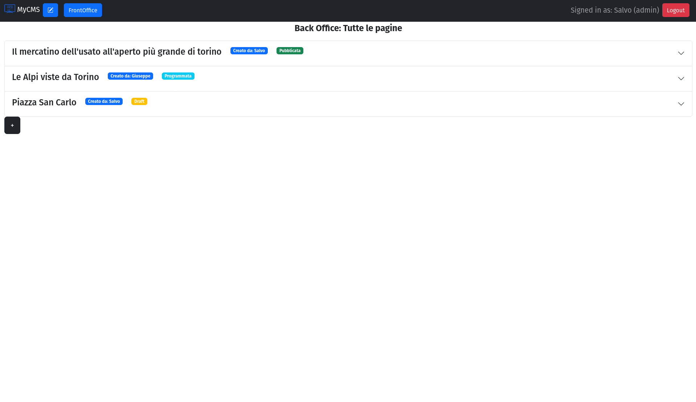
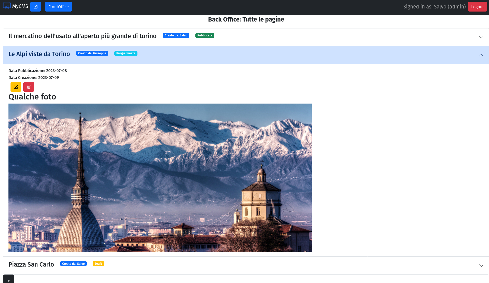
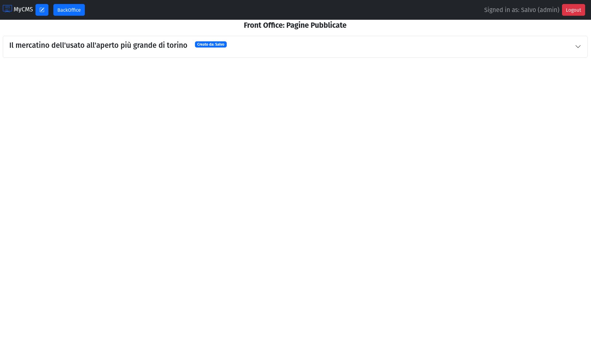
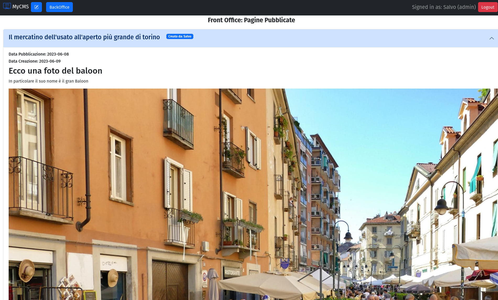
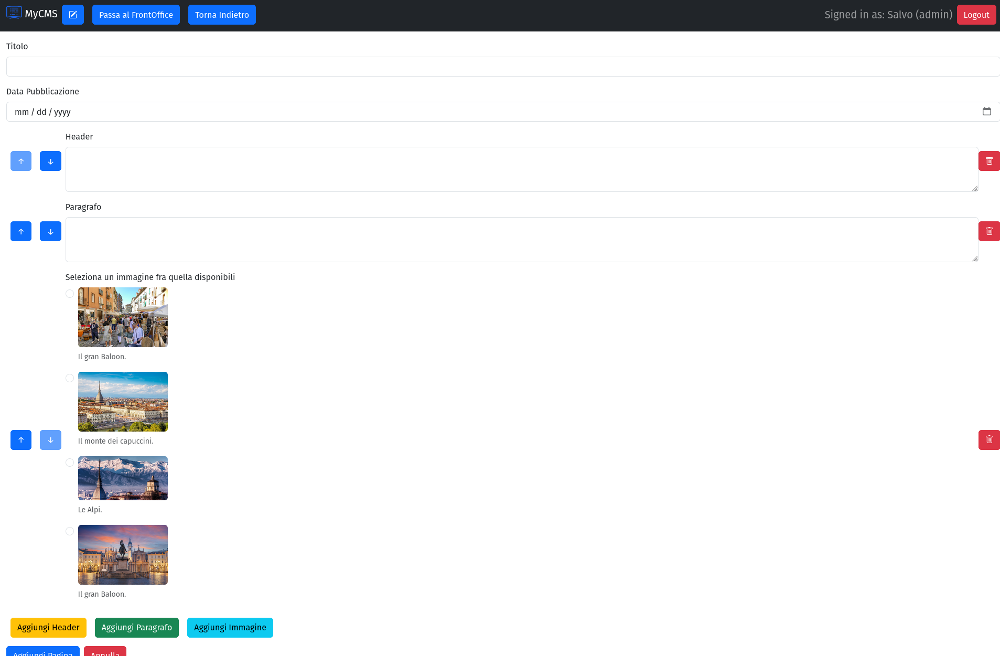

[](https://classroom.github.com/a/suhcjUE-)
# Exam #1: "CMSmall"
## Student: s317842 CAVALLARO SALVATORE 

## React Client Application Routes

- Route `/`: pagina principale che mostra il frontoffice
- Route `/login`: pagina per effettuare il login
- Route `/add`: pagina per aggiungere una nuova pagina
- Route `/edit/:PageId`: pagina per editare una pagina esistente
- Route `/edit/:IdTitolo`: pagina per editare il titolo del sito web
- Route `*`: per le pagine che non esistono


## API Server

### Autenticazione

- POST `/api/session`
  Descrizione: Crea una nuova sessione a partire dalla credenziali fornite.

  Request body:
  ```
  {
    "username": "salvo@test.com",
    "password": "pwd"
  }
  ```

Response: `200 OK` (success) or `500 Internal Server Error` (generic error).

Response body: _None_

- GET `/api/session/current`

  Descrizione: Verifica se la sessione data è ancora valida e restituisce le informazioni sull'utente connesso. Per ottenere le informazioni sull'utente autenticato nella sessione corrente, è necessario fornire un cookie con un Id di sessione valido

  Request body: _None_ 

  Response: `201 Created` (success) or `401 Unauthorized` (error).

  Response body:
  ```
  {
    "username": "salvo@test.com",
    "id": 1,
    "name": "Salvo"
  }
  ```
  

  -DELETE `/api/session/current`

    Descrizione: Elimina la sessione attualw. è necessario fornire un cookie con un Id di sessione valido.

    Request body: _None_

    Response: `200 OK` (success) or `500 Internal Server Error` (generic error).

    Response body: _None_


### Altre 

 - GET `/api/pages` : Non autenticata, ritorna la lista delle pagine pubblicate
   (devo stabilire un formato JSON appropriato)

- GET `/api/titolo` : Non autenticata, ritorna il titolo del sito web    Parametri: NESSUNO ????????????????

- GET `/api/utenti` : Non autenticata, ritorna la lista di autori presenti nel DB

- POST `/api/pages` : Autenticata, salva la pagina creata 
 Request body:
  ```
  {
    "titolo": "Una nuova pagina",
    "id": 1,
    "name": "Salvo",
    "datacreazione": "2023-09-08",   
    "datacreazione": "2023-09-08"
    [
      {
        "idpagina":3,
        "idblocco":1,
        "contentuto":"Torino"
        "priorità":1
      },
      {
        "idpagina":3,
        "idblocco":2,
        "contentuto":"una città storica"
        "priorità":2
      }
    ]


  }
 
- PUT `/api/pages/<id>` : Autenticata, salva la pagina modificata
 Request body:
  ```
    id:req.params.id,
    titolo: req.body.titolo,
    autore: req.body.autore, //req.user.id
    datapubblicazione: req.body.datapubblicazione,


    blocchi=req.body.blocchi


      edit blocco
          idpagina: req.params.id,
          contenuto: e.contenuto,
          priorità: e.priorità
      nuovo blocco
          idpagina: req.params.id,
          idblocco: e.idblocco,
          contenuto:e.contenuto,
          priorità:e.priorità,
  ```

- DELETE `/api/pages/<id>` : Autenticata, cancella la pagina

- PUT `/api/titolo/<id>` : Autenticata, salva le modifiche al titolo del sito

- DELETE `/api/blocks/<id>` : Autenticata, cancella i blocchi relativi ad una pagina


- POST `/api/something`
  - request parameters and request body content
  - response body content
- ...

## Database Tables

- Table `utenti` : (id, nome, admin: (1=admin), email, salt, hash)
- Table `pagine`: (id,titolo,autore,datacreazione,datapublicazione)
- Table `blocchicotenuto`: (id,tipo)
- Table `blocchiapagine`:(id,idpagina,idblocco,contenuto,priorità)
- Table `blocchicotenuto`: (id,titolo)

## Main React Components

- `LoginForm` (in `LoginComponent.jsx`): componente per gestire il form di login
- `NavHeader` (in `NavComponents.jsx`): componente per gestire la navbar
- `MainPages` (in `PageComponents.jsx`): componente per la visualizzazione delle pagina create
- `TheForm` (in `PageForm.jsx`): componente per gestire il form di aggiunta modifica pagina
- `TitleForm` (in `PageForm.jsx`): componente per gestire il form di modifica del titolo del sito


## Screenshot







## Users Credentials

- username: salvo@test.com, password:"pwd", usertype:admin
- username: giuseppe@test.com, password:"pwd", usertype: not admin 
- username: riccardo@test.com, password:"pwd", usertype:admin
- username: ilenia@test.com, password:"pwd", usertype: not admin 


